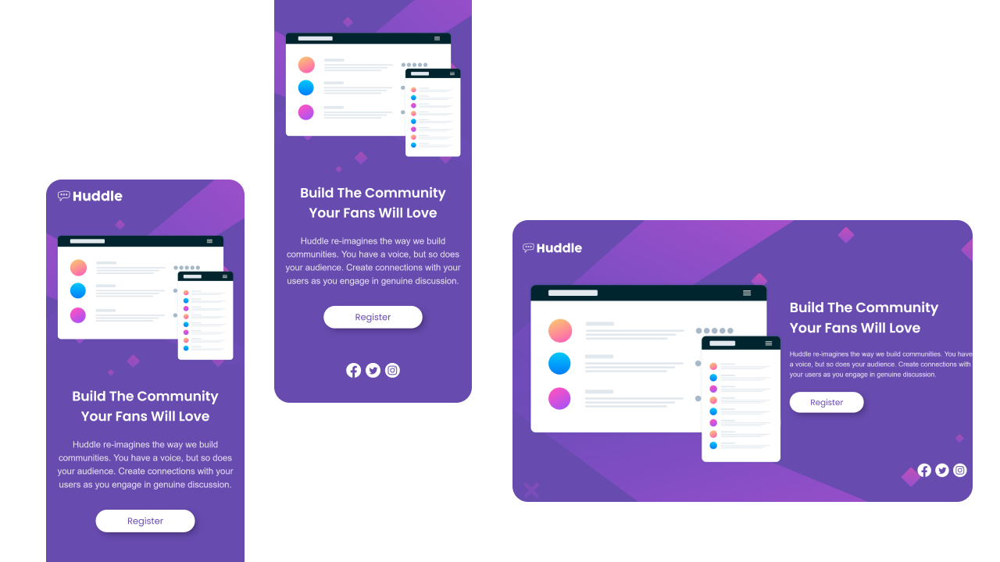

# Huddle landing page with single introductory section

This is the solution to the [Huddle landing page on Frontend Mentor](https://www.frontendmentor.io/challenges/blog-preview-card-ckPaj01IcS). This solution ensures a visually appealing and responsive blog preview card with optimal layout for various screen sizes.

## Table of contents

- [Overview](#overview)
  - [The challenge](#the-challenge)
  - [Screenshot](#screenshot)
  - [Links](#links)
- [My process](#my-process)
  - [Built with](#built-with)
  - [What I learned](#what-i-learned)
  - [Useful resources](#useful-resources)
- [Author](#author)

## Overview

### The challenge

- Develop the given Huddle landing page with single introductory section.

- Users should be able to view the optimal layout for the site depending on their device's screen size.

### Screenshot

- Design preview of the Huddle landing page.



### Links

- Solution URL: [Click here](https://github.com/sayeedmunees/blog-preview-card-challenge)

- Live Site URL: [Click here](https://sayeedmunees.github.io/blog-preview-card-challenge/)

## My process

### Built with

- Semantic HTML5 markup
- CSS custom properties
- CSS Flexbox
- Mobile-first workflow

### What I learned

Throughout this project, I've gained valuable insights into the potential of CSS filters, particularly in enhancing the visual appeal of PNG images. By utilizing the filter property, I've learned how to dynamically alter image properties like brightness, saturation, and hue. This knowledge enabled me to transform a black PNG Twitter logo into a vibrant pink hue upon hover, enhancing its interactivity and visual impact.

Here's a snippet demonstrating the use of filter :

```css
#social-icons img {
  color: white;
  filter: brightness(100) saturate(0);
  margin: 5px;
  margin-bottom: 20px;
  height: 32px;
  width: 32px;
}

#social-icons img:hover {
  cursor: pointer;
  filter: none;
}
```

### Useful resources

- [Frontend Mentor](ttps://www.frontendmentor.io/challenges/blog-preview-card-ckPaj01IcS) - Got this challenge from Frontend Mentor,along with workfiles like required designs, icons and other files.

- [MDN Docs](https://developer.mozilla.org/en-US/) - Here's another useful resourse, which is the MDN web Docs itself. It helped me to find, understand and to use code snippets that i didn't knew before.

## Author

- GitHub - [@sayeedmunees](https://github.com/sayeedmunees)
